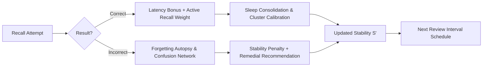
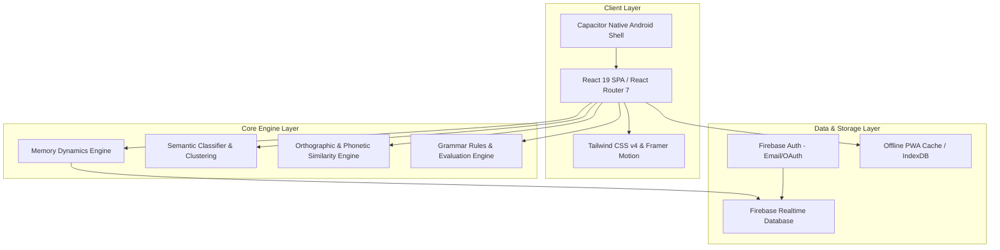

<div align="center">

# ⚡ VOC — Adaptive Vocabulary, Grammar & IELTS Platform

**Next-generation cognitive language learning system powered by an adaptive memory engine.**

[](https://react.dev/)
[](https://vitejs.dev/)
[](https://tailwindcss.com/)
[](https://firebase.google.com/)
[](https://capacitorjs.com/)
[](https://vitest.dev/)
[](https://opensource.org/licenses/MIT)

[Features](#-key-features) • [Memory Architecture](#-cognitive-memory-engine) • [System Architecture](#-system-architecture) • [Roadmap](#-memory-twin-roadmap) • [Getting Started](#-getting-started) • [Deployment](#-deployment)

</div>

---

## 📌 Executive Summary

**VOC** is an enterprise-grade, intelligent language acquisition platform built for English learners. Unlike traditional learning apps that rely on static intervals or generic flashcards, VOC leverages a custom **Individual Memory Dynamics Engine** (`src/utils/memoryEngine.js`) that models how each learner's brain retains, calibrates, and forgets vocabulary.

VOC operates cross-platform as a progressive web application (PWA) and as a native Android app via Capacitor, serving **40+ active learners** with **2,600+ mastered vocabulary terms**.

> *"Duolingo tells you what to study. Anki tells you when to review. VOC learns how your brain retains and forgets."*

---

## 🎯 Table of Contents

- [🧠 Cognitive Memory Engine](#-cognitive-memory-engine)
- [🏗 System Architecture](#-system-architecture)
- [🗺 Memory Twin Roadmap](#-memory-twin-roadmap)
- [✨ Key Features](#-key-features)
  - [📚 Vocabulary Boost Engine](#-vocabulary-boost-engine)
  - [📖 Grammar & IELTS Prep](#-grammar--ielts-prep)
  - [🧬 Memory Lab & Insights](#-memory-lab--insights)
  - [🏆 Gamification & Analytics](#-gamification--analytics)
- [🛠 Tech Stack & Dependencies](#-tech-stack--dependencies)
- [📂 Directory Structure](#-directory-structure)
- [🚀 Getting Started](#-getting-started)
- [🧪 Testing & Quality Control](#-testing--quality-control)
- [📱 Deployment & Build Pipeline](#-deployment--build-pipeline)
- [🤝 Contributing & License](#-contributing--license)

---

## 🧠 Cognitive Memory Engine

Standard spaced repetition algorithms (such as SM-2 or Leitner systems) rely on static global multipliers. VOC implements a personalized continuous forgetting function based on cognitive stability dynamics:

$$P(t) = e^{-\frac{t}{S}}$$

Where:
* **$P(t)$**: Probability of successful recall after $t$ elapsed days.
* **$S$**: Dynamic **Memory Stability** score calculated individually per user $\times$ per word pair.

```
                  Memory Retention Probability P(t) over Time
  100% | *
       |   *
  P(t) |     *  <-- Forgetting Curve (Decay rate inversely proportional to S)
       |       * . . . . . . . . . . . . . . . . . -> Extended Stability (S') after Active Review
    0% +------------------------------------------------------------------------------------> Time (t in days)
```

### Algorithmic Signals & Multi-Factor Inputs



1. **Response Latency Tuning ($\Delta L$)**: Reaction speed serves as an implicit indicator of recall confidence. Rapid correct responses boost stability growth, whereas hesitant correct answers yield reduced gains.
2. **Retrieval Mode Weighting ($w_{\text{retrieval}}$)**: Differentiates active retrieval (orthographic typing/spelling) from passive self-assessment (flashcard flipping). Active recall produces significantly higher stability increments (the *testing effect*).
3. **Sleep-Cycle Consolidation**: Reviews spanning overnight rest receive a cognitive consolidation factor, rewarding long-term retention.
4. **Semantic Domain Calibration**: Automatically categorizes vocabulary into semantic clusters (e.g., *Technology*, *Emotions*, *Academic Verbs*). Empirical accuracy within a cluster automatically tunes stability predictions across related terms.

---

## 🏗 System Architecture



---

## 🗺 Memory Twin Roadmap

VOC's long-term vision is to evolve from a spaced-repetition scheduler into a digital **Memory Twin** — a personal cognitive profile that models recall bottlenecks, inter-word interference, and optimal learning modalities.

### 🟢 Production Status (Active in Application)

| Module / Component | Architecture / File Source | Operational Scope |
| :--- | :--- | :--- |
| **Memory Dynamics Engine** | `src/utils/memoryEngine.js` | $P(t) = e^{-t/S}$ retention decay with per-word stability state. |
| **Future Memory Simulator** | `memoryEngine.js` $\rightarrow$ `MemoryInsights.jsx` | 30-day interactive simulation comparing retention under 0, 1, 3, 7, 14-day review intervals. |
| **Forgetting Autopsy** | `src/utils/forgettingAutopsy.js` | Diagnostic analysis of failure factors (latency, interval, confusion) with targeted practice suggestions. |
| **Confusion Pair Network** | `src/experiment/textSimilarity.js` | Distance-based similarity detection mapping confusable word pairs in spelling modes. |
| **Semantic Taxonomy Calibration** | `src/utils/semanticClassifier.js` | Automated domain grouping with per-cluster accuracy calibration. |
| **Scheduling Transparency** | `explainSchedulingDecision()` | Human-readable explanation of review timing logic for every word. |

### 🟡 Pipeline & In-Progress (Infrastructure Ready)

| Feature | Description | Implementation Complexity |
| :--- | :--- | :--- |
| **Automated Remedial Routing** | Direct auto-launch of practice modes based on Forgetting Autopsy diagnostics. | **Low**: Practice games ready; route navigation binding needed. |
| **Omni-Mode Confusion Tracking** | Extend confusion pairing across Flashcards, Quiz, and Sentence Builder. | **Low**: Leverages existing `findConfusableMatch` helper. |

### 🔮 Future Research & Exploration

| Research Goal | Objective | Technical Prerequisites |
| :--- | :--- | :--- |
| **Memory Fingerprint** | Modality retention breakdown (Visual vs. Auditory vs. Contextual). | Multi-game modality telemetry tracking. |
| **L1 Interference Genome** | Native language error transfer pattern analysis. | Longitudinal error corpus dataset. |
| **Lexical Knowledge Graph** | Word association and semantic distance mapping. | WordNet / Lexical graph database integration. |
| **Historical Retention Replay** | 90-day time-series snapshot visualizer. | Time-series state snapshot database persistence. |

---

## ✨ Key Features

### 📚 Vocabulary Boost Engine
* **Custom Packs**: Create, edit, tag, export, and import personalized word collections.
* **Marketplace Packs**: Instant 1-click installation of curated packs (*Irregular Verbs*, *Phrasal Verbs*, *Academic Word List*, *IELTS High-Frequency*).
* **7 Interactive Practice Engines**:
  1. 🎴 **Smart Flashcards**: Flip cards with native audio synthesis and confidence scoring.
  2. ✍️ **Spelling Trainer**: Active orthographic recall with instant error highlight & confusion pairing.
  3. 🧩 **Match Pairs**: Speed association matching under time pressure.
  4. ❓ **Multiple Choice Quiz**: Distractor-boosted vocabulary recognition.
  5. 🎙️ **Speech Pronunciation**: Real-time Web Speech API audio evaluation.
  6. 📝 **Sentence Builder**: Syntax order puzzle constructor.
  7. ⚡ **Irregular Verbs Trainer**: Dedicated 3-form verb conjugate matrix trainer.
* **Leech Word Detection**: Automatic isolation of high-failure terms for targeted remediation.

### 📖 Grammar & IELTS Prep
* **34 Curriculum Modules**: 22 Beginner and 12 Intermediate topics with concise rules, structural diagrams, and usage examples.
* **6 Exercise Types per Topic**: Multiple choice, blank filling, sentence assembly, error spotter, transformation, and dialog completion.
* **Full-Length IELTS Practice Suite**: Real-time timed exam simulator, open-ended writing response evaluation, and granular band performance reports.

### 🧬 Memory Lab & Insights
* Real-time interactive charts illustrating retention decay curves, stability distributions, and confusion networks.
* Personal learning velocity diagnostics and stability growth analytics.

### 🏆 Gamification & Progress Tracking
* **Daily Streaks**: Streak counters with protection mechanics.
* **Contribution Heatmap**: GitHub-style activity grid tracking study volume over time.
* **Milestone Achievements**: System-wide achievement badges for vocabulary size, mastery milestones, and practice consistency.
* **Deep Analytics**: Powered by Recharts with mastery ratios, review queue projections, and learning rates.

---

## 🛠 Tech Stack & Dependencies

```
+-----------------------------------------------------------------------+
|                             FRONTEND                                  |
|   React 19  |  React Router 7  |  Vite 8  |  Tailwind CSS v4          |
|   Framer Motion  |  Recharts  |  Lucide React                        |
+-----------------------------------------------------------------------+
|                             BACKEND & DATA                            |
|   Firebase Authentication  |  Firebase Realtime Database              |
+-----------------------------------------------------------------------+
|                             MOBILE & PWA                              |
|   Capacitor (Android Wrapper)  |  Web Service Worker (Offline PWA)    |
+-----------------------------------------------------------------------+
|                             QUALITY & TEST                            |
|   Vitest  |  Testing Library  |  ESLint 10  |  TypeScript (Types)     |
+-----------------------------------------------------------------------+
```

---

## 📂 Directory Structure

```
VOC/
├── android/                    # Capacitor Android native platform codebase
├── public/                     # Static assets, PWA manifest, service worker
├── src/
│   ├── components/             # Reusable UI component library
│   │   ├── Auth/               # Login, Signup, Protected Routes
│   │   ├── Layout/             # Navbar, Sidebar, Footer, Page Containers
│   │   ├── Practice/           # 7 Practice game mode implementations
│   │   └── Words/              # Word list management, Pack cards, Modals
│   ├── contexts/               # React Context Providers (Auth, Packs, Theme)
│   ├── data/                   # Static Datasets (Grammar, IELTS, Market Packs)
│   ├── experiment/             # Memory Lab & Research diagnostic tools
│   ├── hooks/                  # Firebase & Application Custom React Hooks
│   ├── pages/                  # Page-level route views (Dashboard, Practice, Admin, etc.)
│   ├── utils/                  # Algorithmic engine (Memory Engine, Similarity, Achievements)
│   ├── App.jsx                 # Main application component & routes
│   └── main.jsx                # DOM entry point
├── database.rules.json         # Firebase Realtime Database Security Rules
├── firestore.rules             # Firestore Security Rules
├── vite.config.js              # Vite & Vitest configuration manifest
├── vercel.json                 # Vercel SPA routing & asset caching headers
└── package.json                # Project dependencies & scripts
```

---

## 🚀 Getting Started

### Prerequisites
* **Node.js**: `^18.0.0` or `^20.0.0`
* **npm**: `^9.0.0` or higher

### 1. Repository Setup
```bash
git clone https://github.com/your-username/voc.git
cd voc
npm install
```

### 2. Environment Setup
Create a `.env` file in the root directory:
```env
VITE_FIREBASE_API_KEY=your_api_key
VITE_FIREBASE_AUTH_DOMAIN=your_project.firebaseapp.com
VITE_FIREBASE_DATABASE_URL=https://your_project.firebaseio.com
VITE_FIREBASE_PROJECT_ID=your_project_id
VITE_FIREBASE_STORAGE_BUCKET=your_project.appspot.com
VITE_FIREBASE_MESSAGING_SENDER_ID=your_sender_id
VITE_FIREBASE_APP_ID=your_app_id
```

### 3. Launch Local Server
```bash
npm run dev
```
Navigate to `http://localhost:5173`.

---

## 🧪 Testing & Quality Control

VOC includes unit tests covering pure algorithmic modules (`memoryEngine.js`, `textSimilarity.js`, `spacedRepetition.js`, `achievements.js`).

```bash
# Run unit test suite
npm test

# Run tests in watch mode
npm run test:watch

# Execute ESLint verification
npm run lint
```

---

## 📱 Deployment & Build Pipeline

### Production Web Build
```bash
npm run build
npm run preview
```

### Deploying Database Rules
```bash
firebase deploy --only database
```

### Compiling Native Android Application
```bash
# Build production web bundle
npm run build

# Sync assets to Capacitor native container
npx cap sync android

# Open Android Studio to build APK or AAB bundle
npx cap open android
```

---

## 🤝 Contributing & License

Contributions are welcome! Please feel free to open issues or submit pull requests.

Distributed under the **MIT License**. See `LICENSE` for more information.

---

<div align="center">

Crafted with ❤️ for English language learners worldwide.

</div>
