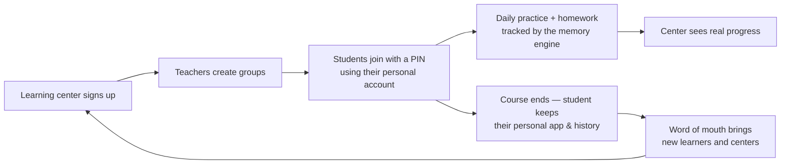
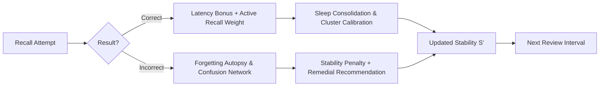
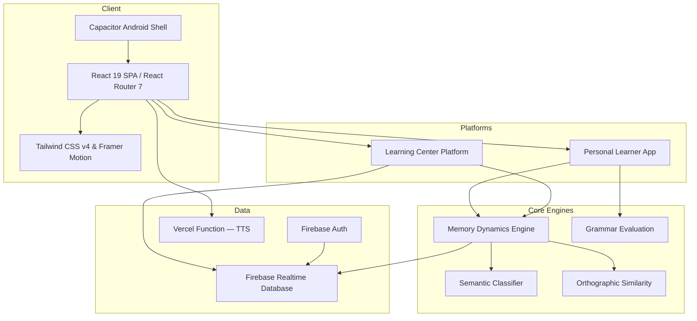

<div align="center">

# ⚡ VOC — Adaptive English Vocabulary & Grammar Platform

**For individual learners and the learning centers that teach them — powered by an adaptive memory engine.**

[](https://react.dev/)
[](https://vitejs.dev/)
[](https://tailwindcss.com/)
[](https://firebase.google.com/)
[](https://capacitorjs.com/)
[](https://vitest.dev/)

[Product](#-one-product-two-sides) • [Memory Engine](#-cognitive-memory-engine) • [Features](#-key-features) • [Architecture](#-system-architecture) • [Roadmap](#-roadmap) • [Getting Started](#-getting-started)

</div>

---

## 📌 Executive Summary

**VOC** is an English learning platform for vocabulary and grammar. It serves two customers with one product:

- **B2C — individual learners** get a personal study app driven by a custom **Individual Memory Dynamics Engine** (`src/utils/memoryEngine.js`) that models how each learner retains and forgets every word.
- **B2B — learning centers** get a multi-tenant platform to run groups, assign packs and homework, and see each student's real progress.

VOC runs as a progressive web app (PWA) and as a native Android app via Capacitor, serving **40+ active learners** with **2,600+ mastered vocabulary terms**.

> *"Duolingo tells you what to study. Anki tells you when to review. VOC learns how your brain retains and forgets."*

---

## 🔁 One Product, Two Sides

VOC is a single system, not two apps. A student always uses their **own personal VOC account**; joining a learning center's group (by a 6-digit PIN) switches that same account into group mode.



| | B2B — Learning centers | B2C — Individual learners |
| :--- | :--- | :--- |
| **Role in the business** | Distribution channel and revenue | Core product and long-term retention |
| **Value** | Teachers control homework and results; admins see center-wide statistics | Adaptive spaced repetition, grammar path, personal analytics |
| **Effect on the other side** | Brings learners in at low acquisition cost | Keeps learners after the course ends (higher lifetime value) |

---

## 🧠 Cognitive Memory Engine

Standard spaced repetition algorithms (such as SM-2 or Leitner systems) rely on static global multipliers. VOC implements a personalized continuous forgetting function based on memory stability:

$$P(t) = e^{-\frac{t}{S}}$$

Where:
* **$P(t)$**: Probability of successful recall after $t$ elapsed days.
* **$S$**: Dynamic **Memory Stability**, calculated individually per user × per word.



1. **Response latency**: fast correct answers grow stability more than hesitant ones.
2. **Retrieval mode weighting**: active recall (typing, speaking) counts more than passive recognition (flipping a flashcard) — the *testing effect*.
3. **Sleep consolidation**: reviews spanning a night's rest get a consolidation factor.
4. **Semantic calibration**: words are grouped into semantic clusters, and accuracy within a cluster tunes predictions for related words.

---

## ✨ Key Features

### 📚 Vocabulary
* **Personal packs**: create, organize into folders, import from JSON, or extract words from a photo.
* **Marketplace packs**: one-click install of curated packs — *Irregular Verbs*, *Phrasal Verbs*, *Collocations*, *Prepositions*, *Essential 3000*, *Science*, *Health*, *I'm Ready September*.
* **Reading mode**: full chapter texts for book-based packs, read page by page alongside the pack's words.
* **7 practice modes**:
  1. 🎴 **Flashcards** with audio and confidence scoring
  2. ✍️ **Spelling** — active recall with error highlighting and confusion pairing
  3. 🔀 **Match Pairs**
  4. 📝 **Multiple Choice Quiz**
  5. ⏱️ **Speed Round**
  6. 🎙️ **Pronunciation** — Web Speech API evaluation
  7. ⚡ **Irregular Verbs Trainer** — V1/V2/V3 forms
* **Leech detection**: words that keep failing are isolated for targeted review.

### 📖 Grammar
* **Topic library**: 71 topics across Beginner, Intermediate, Upper-Intermediate and Advanced, each with a guide (Uzbek or Russian explanations) and 6 exercise types.
* **Grammar Path**: a sequential, Duolingo-style path that starts from zero.
* **Grammar tests**: timed exam variants with history and per-question review, plus a general grammar test.

### 🏫 Learning Center Platform (`/corp`)
* **Roles**: super admin → center admin → teacher → student.
* **Center admin**: manages teachers, students, custom courses, and center-wide statistics.
* **Teacher**: creates groups, assigns packs and homework, tracks each student, archives or transfers groups.
* **Student**: joins by PIN from their own profile; sees the group's learning plan, assessments, and homework.
* **Independent teachers**: a personal account can also teach its own groups without a center.

### 🧬 Memory Lab & Analytics
* Retention decay curves, stability distribution, and confusion networks.
* 30-day future-memory simulator and a human-readable explanation of every scheduling decision.
* Daily streaks, a GitHub-style activity heatmap, achievements, and mastery/queue charts (Recharts).

---

## 🏗 System Architecture



---

## 🗺 Roadmap

### 🟢 In production

| Module | Source | Scope |
| :--- | :--- | :--- |
| **Memory Dynamics Engine** | `src/utils/memoryEngine.js` | $P(t) = e^{-t/S}$ decay with per-word stability. |
| **Future Memory Simulator** | `memoryEngine.js` → `MemoryInsights.jsx` | 30-day retention simulation under different review intervals. |
| **Forgetting Autopsy** | `src/utils/forgettingAutopsy.js` | Explains why a word was forgotten and suggests targeted practice. |
| **Confusion Pair Network** | `src/experiment/textSimilarity.js` | Detects confusable word pairs in spelling modes. |
| **Semantic Calibration** | `src/experiment/semanticClassifier.js` | Domain grouping with per-cluster accuracy calibration. |
| **Learning Center Platform** | `src/pages/corp/`, `src/services/corpService.js` | Centers, teachers, groups, homework, statistics. |

### 🟡 Next

| Feature | Description |
| :--- | :--- |
| **Automated remedial routing** | Launch the right practice mode straight from a Forgetting Autopsy diagnosis. |
| **Confusion tracking in every mode** | Extend confusion pairing to Flashcards and Quiz. |

### 🔮 Research

| Goal | Objective |
| :--- | :--- |
| **Memory Fingerprint** | Retention breakdown by modality (visual, auditory, contextual). |
| **L1 Interference Genome** | How the learner's native language shapes their English errors. |
| **Lexical Knowledge Graph** | Word association and semantic distance mapping. |

---

## 🛠 Tech Stack

| Layer | Technologies |
| :--- | :--- |
| **Frontend** | React 19, React Router 7, Vite 8, Tailwind CSS v4, Framer Motion, Recharts, Lucide |
| **Backend & Data** | Firebase Authentication, Firebase Realtime Database, Vercel serverless function (TTS) |
| **Mobile & PWA** | Capacitor (Android), service worker |
| **Quality** | Vitest, Testing Library, ESLint, TypeScript checks |

---

## 📂 Directory Structure

```
VOC/
├── android/                 # Capacitor Android project
├── api/                     # Vercel serverless functions (text-to-speech)
├── public/                  # Static assets, PWA manifest, service worker
├── src/
│   ├── components/          # Shared UI (Practice modes, Packs, Words, Layout, corp/)
│   ├── contexts/            # Auth, Packs, Language, Theme, GroupMode providers
│   ├── data/                # Grammar datasets, courses, marketplace packs, chapter texts
│   ├── experiment/          # Memory Lab, semantic classifier, text similarity
│   ├── hooks/               # Firebase-backed React hooks
│   ├── i18n/                # UI translations (English, Russian, Uzbek)
│   ├── pages/
│   │   ├── personal/        # B2C learner app (dashboard, library, practice, stats)
│   │   ├── grammar/         # Grammar topics, path, and tests
│   │   ├── corp/            # B2B learning center platform
│   │   ├── teacher/         # Independent teacher mode
│   │   └── admin/           # Internal admin dashboard
│   ├── services/            # Corp, independent-teacher, and group services
│   ├── utils/               # Memory engine, spaced repetition, helpers
│   └── App.jsx              # Routes
├── database.rules.json      # Realtime Database security rules
├── vite.config.js           # Vite & Vitest configuration
└── vercel.json              # SPA routing & cache headers
```

---

## 🚀 Getting Started

### Prerequisites
* **Node.js** 20+
* **npm** 9+

### Setup
```bash
git clone <repository-url>
cd VOC
npm install
```

The Firebase client config lives in `src/firebase.js`. Optional AI features read one variable from `.env`:
```env
VITE_GEMINI_API_KEY=your_key
```

### Run
```bash
npm run dev
```
Open `http://localhost:5173`.

---

## 🧪 Testing

Unit tests cover the algorithmic modules: memory engine, spaced repetition, forgetting autopsy, text similarity, achievements, grammar helpers, and marketplace sync.

```bash
npm test            # run once
npm run test:watch  # watch mode
npm run lint        # ESLint
```

---

## 📱 Build & Deployment

```bash
# Production web build (deployed on Vercel)
npm run build
npm run preview

# Realtime Database security rules
firebase deploy --only database

# Android
npm run build
npx cap sync android
npx cap open android
```

---

<div align="center">

Built for English learners and the learning centers that teach them.

</div>
